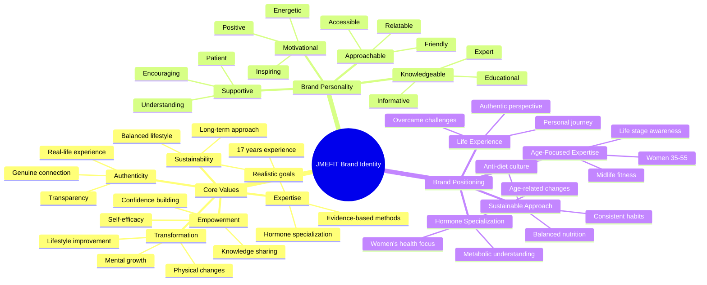

# JMEFIT Brand Identity Diagram

## Core Brand Identity

The following diagram illustrates the key components of JMEFIT's brand identity, including core values, brand personality, and brand positioning.

## Brand Voice & Tone

JMEFIT's communication style is characterized by:

| Attribute | Description | Example |
|-----------|-------------|---------|
| **Conversational** | Friendly, accessible language | "Hey there! Let's talk about how your hormones affect your workout results." |
| **Empathetic** | Understanding of challenges | "I know how frustrating it can be when you're working hard but not seeing results." |
| **Educational** | Informative without being condescending | "Here's what happens in your body when cortisol levels rise and how it affects fat storage." |
| **Motivational** | Encouraging without toxic positivity | "Small, consistent steps forward will create the lasting changes you're looking for." |
| **Authentic** | Real, relatable, and honest | "I've been where you are—overworked, overwhelmed, and overthinking nutrition." |

## Visual Identity Elements

### Color Palette
- **Primary Colors**: [To be determined based on website analysis]
- **Secondary Colors**: [To be determined based on website analysis]
- **Accent Colors**: [To be determined based on website analysis]

### Typography
- **Headings**: [To be determined based on website analysis]
- **Body Text**: [To be determined based on website analysis]
- **Accent Text**: [To be determined based on website analysis]

### Imagery Style
- Authentic, relatable fitness content
- Real bodies and real progress
- Warm, encouraging atmosphere
- Professional but approachable aesthetic
- Emphasis on strength and capability, not just appearance

## Brand Taglines

1. "Transform Your Body. Transform Your Life."
2. "Fitness That Works With Your Body, Not Against It"
3. "Sustainable Fitness for Real Women"
4. "Hormone-Smart Fitness Solutions"
5. "Stronger and Fitter at Any Age"
