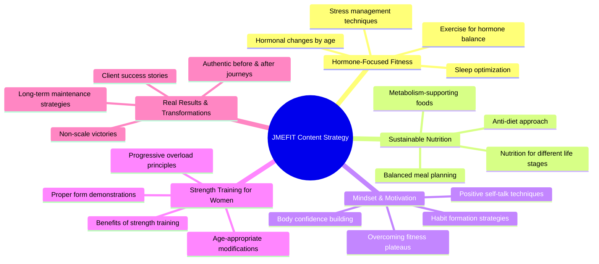
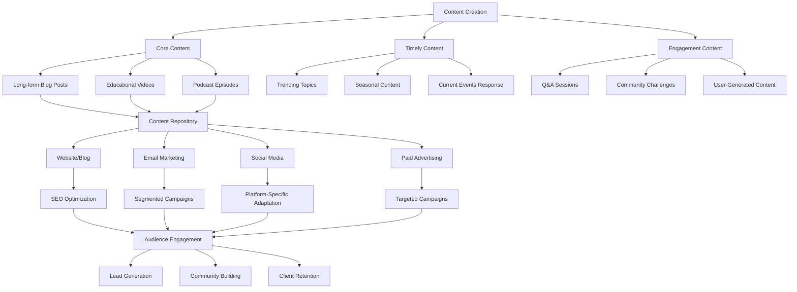
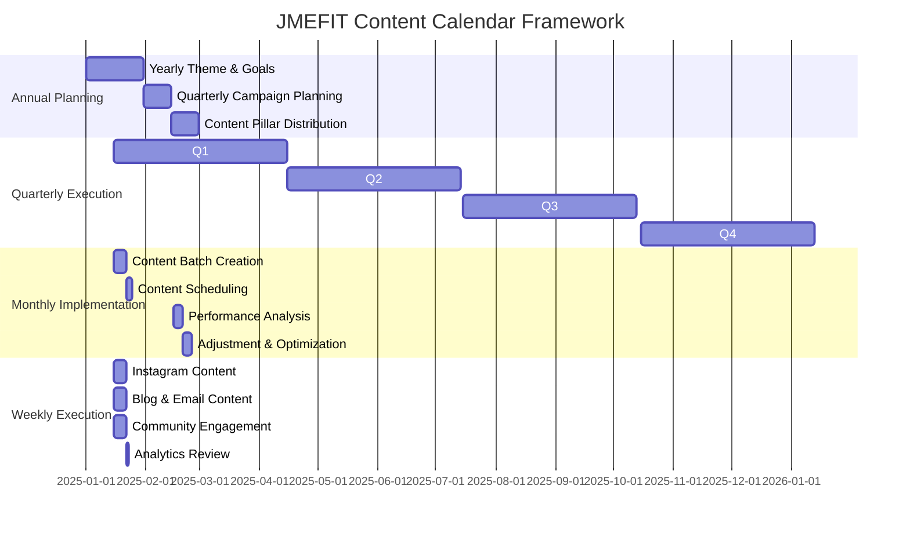
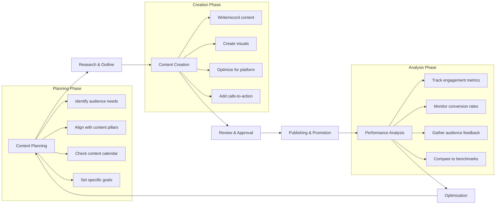
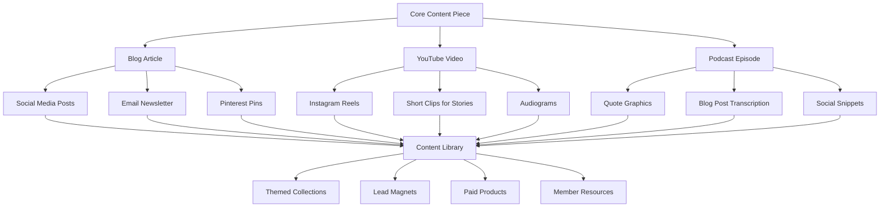

# JMEFIT Content Strategy Flowchart

## Content Pillars Overview

The following diagram illustrates JMEFIT's five core content pillars and how they interconnect to create a comprehensive content strategy.

## Content Distribution Strategy

The following flowchart illustrates how content moves through different platforms in JMEFIT's ecosystem:

## Content Calendar Framework

The following diagram shows how JMEFIT can structure its content calendar across different timeframes:

## Content Type Matrix

| Content Type | Primary Platform | Purpose | Frequency | Content Pillar Alignment |
|--------------|------------------|---------|-----------|--------------------------|
| **Instagram Posts** | Instagram | Brand awareness, Education | 4-5x weekly | All pillars |
| **Instagram Stories** | Instagram | Behind-the-scenes, Daily tips | Daily | All pillars |
| **Instagram Reels** | Instagram | Trend participation, Quick tips | 2-3x weekly | All pillars with emphasis on workouts |
| **Blog Articles** | Website | SEO, In-depth education | 1-2x monthly | All pillars with emphasis on education |
| **Email Newsletter** | Email | Nurturing, Exclusive content | Weekly | All pillars |
| **YouTube Videos** | YouTube | Detailed tutorials, Workouts | 2-4x monthly | Strength Training, Hormone-Focused Fitness |
| **Facebook Posts** | Facebook | Community building, Sharing | 3-4x weekly | Mindset, Real Results |
| **Pinterest Pins** | Pinterest | Traffic driving, Inspiration | 5-7x weekly | Sustainable Nutrition, Workouts |

## Content Creation Process

## Platform-Specific Content Strategy

### Instagram Strategy

Instagram serves as JMEFIT's primary platform for community building and engagement. The content mix should include:

- **Feed Posts (4-5x weekly)**
  - Educational carousels about hormone health
  - Client transformation stories
  - Workout demonstrations
  - Nutrition tips and meal ideas
  - Motivational content and mindset shifts

- **Stories (Daily)**
  - Behind-the-scenes of Jaime's day
  - Quick tips and reminders
  - Polls and questions to boost engagement
  - Sharing user-generated content
  - Highlighting new content on other platforms

- **Reels (2-3x weekly)**
  - Quick workout demonstrations
  - Myth-busting about fitness and nutrition
  - Day-in-the-life content
  - Before and after transformations
  - Trending audio participation (when relevant)

- **IGTV/Instagram Video (1-2x monthly)**
  - Longer workout tutorials
  - Q&A sessions
  - Client interviews
  - Deep dives into specific topics

### Email Marketing Strategy

Email marketing serves as JMEFIT's direct line to the most engaged audience members. The email strategy should include:

- **Weekly Newsletter**
  - Value-first approach with educational content
  - Personal updates from Jaime
  - Subscriber-exclusive tips and resources
  - Highlighting recent content across platforms

- **Nurture Sequences**
  - Welcome sequence for new subscribers
  - Educational sequences about hormone health
  - Pre-launch sequences for program offerings
  - Re-engagement sequences for inactive subscribers

- **Segmented Campaigns**
  - Content tailored to specific audience segments
  - Targeted offers based on engagement and interests
  - Personalized check-ins and milestone celebrations
  - Feedback requests and surveys

## Content Performance Metrics

| Content Type | Key Metrics | Benchmark Goals | Evaluation Frequency |
|--------------|-------------|-----------------|----------------------|
| **Instagram Posts** | Engagement rate, Saves, Shares | 5%+ engagement, 100+ saves | Weekly |
| **Instagram Stories** | Completion rate, Replies, Sticker interactions | 80%+ completion, 20+ interactions | Weekly |
| **Instagram Reels** | Views, Shares, Comments | 1000+ views, 50+ shares | Weekly |
| **Blog Articles** | Time on page, Bounce rate, Conversions | 3+ min average, <40% bounce rate | Monthly |
| **Email Newsletter** | Open rate, Click rate, Unsubscribe rate | 30%+ open rate, 5%+ click rate | Weekly |
| **YouTube Videos** | Watch time, Subscriber conversion, Comments | 50%+ retention, 10+ comments | Monthly |

## Content Repurposing Strategy

