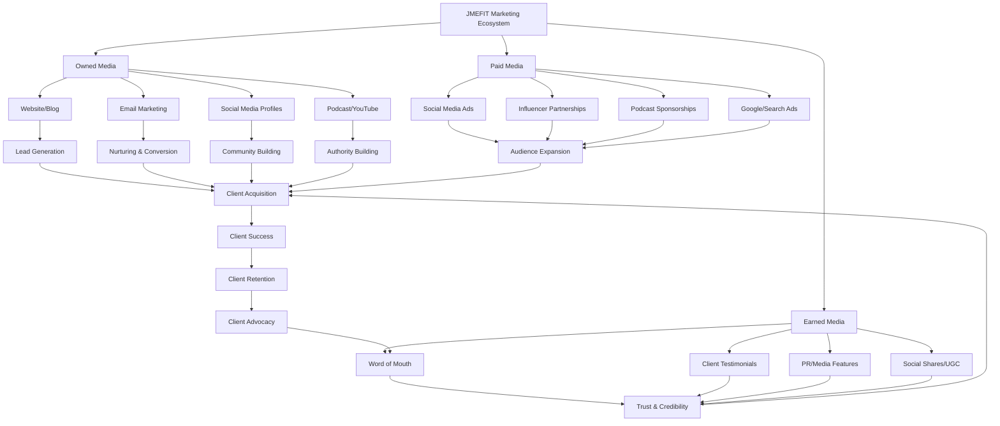
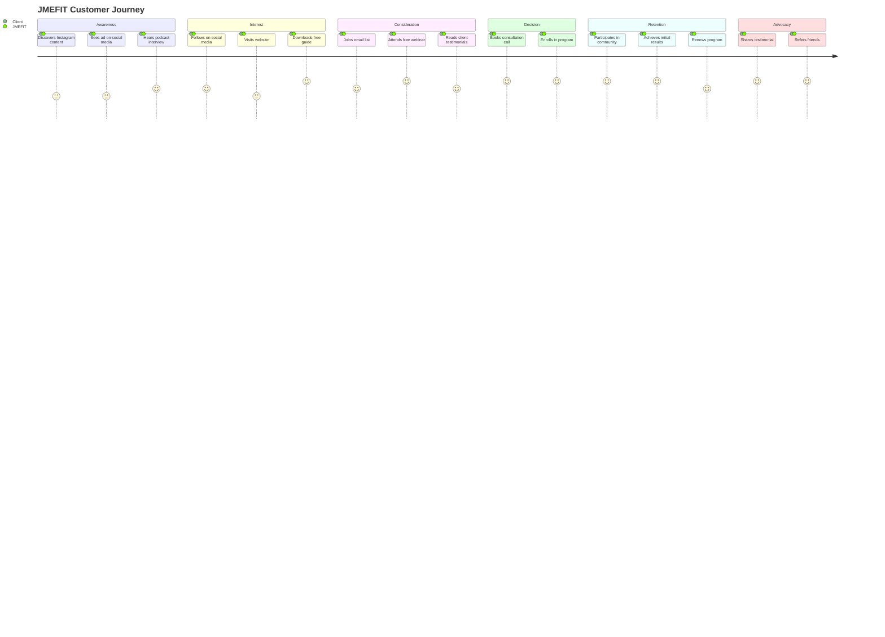
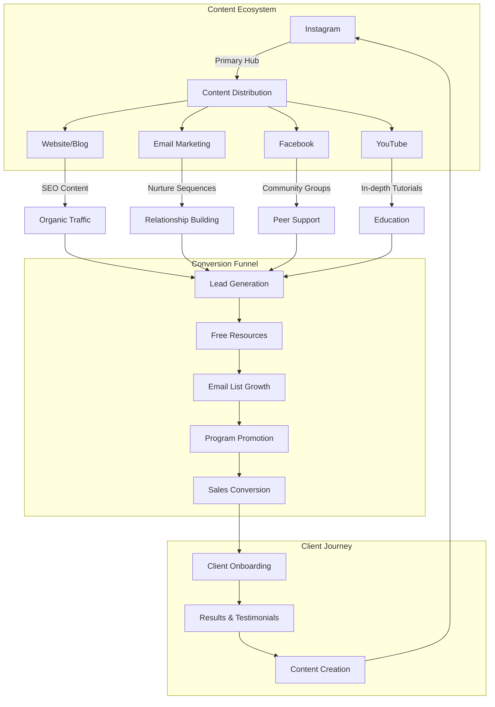
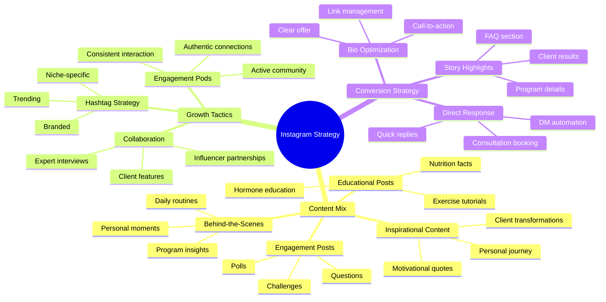
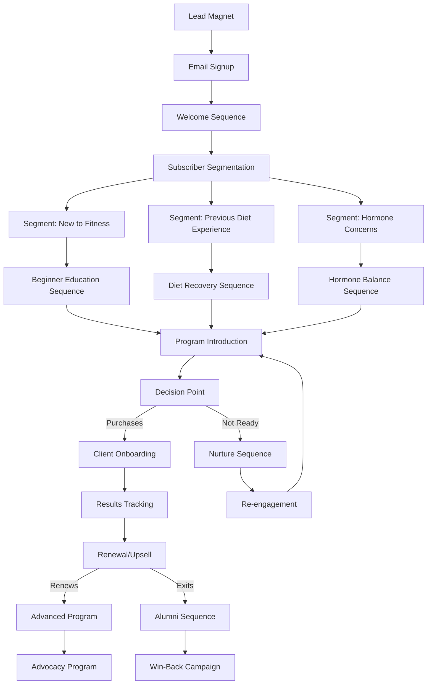
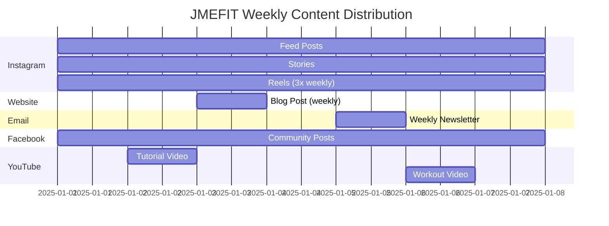
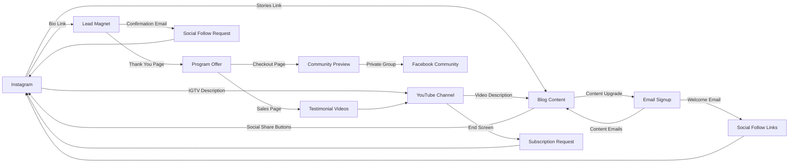

# JMEFIT Marketing Channels Diagram

## Marketing Ecosystem Overview

The following diagram illustrates JMEFIT's integrated marketing ecosystem, showing how different channels work together to attract, engage, and convert the target audience.

## Customer Journey Map

The following diagram maps the customer journey across different marketing channels:

## Channel Priority Matrix

| Channel | Audience Reach | Engagement Potential | Conversion Potential | Resource Investment | Priority Level |
|---------|----------------|----------------------|----------------------|---------------------|---------------|
| **Instagram** | High | Very High | Medium | Medium | Primary |
| **Email Marketing** | Medium | High | Very High | Low | Primary |
| **Website/Blog** | Medium | Medium | High | Medium | Primary |
| **Facebook** | Medium | Medium | Low | Low | Secondary |
| **YouTube** | Low (initially) | High | Medium | High | Secondary |
| **Pinterest** | Medium | Low | Medium | Low | Tertiary |
| **TikTok** | High | High | Low | Medium | Experimental |
| **Podcast Appearances** | Medium | High | Medium | Low | Secondary |
| **Partnerships** | Low | Medium | High | Medium | Tertiary |

## Channel Integration Strategy

## Instagram Marketing Strategy

As JMEFIT's primary platform, Instagram requires a detailed strategy:

## Email Marketing Funnel

## Paid Advertising Strategy

For strategic audience expansion, JMEFIT can implement the following paid advertising approach:

| Platform | Ad Type | Target Audience | Objective | Budget Allocation |
|----------|---------|----------------|-----------|-------------------|
| **Instagram/Facebook** | Feed & Story Ads | Women 35-55, Interest in fitness/wellness | Lead generation | 50% |
| **Instagram/Facebook** | Retargeting Ads | Website visitors, Engagement with content | Conversion | 20% |
| **Google** | Search Ads | Keywords: hormone fitness, women's fitness 40+, etc. | Website traffic | 15% |
| **YouTube** | Pre-roll & In-stream | Women 35-55, Interest in fitness/wellness | Brand awareness | 10% |
| **Pinterest** | Promoted Pins | Women 35-55, Interest in fitness/wellness | Website traffic | 5% |

## Content Distribution Calendar

## Cross-Promotion Strategy

