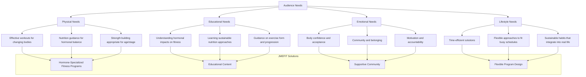

# JMEFIT Target Audience Map

## Audience Overview

JMEFIT serves two primary audience segments, with the main focus on women aged 35-55 who are seeking sustainable fitness solutions that work with their changing bodies and lifestyles.

```mermaid
graph TD
    A[JMEFIT Target Audience] --> B[Primary: Women 35-55]
    A --> C[Secondary: Women 25-35]
    
    B --> D[Demographics]
    B --> E[Psychographics]
    B --> F[Fitness Level & Goals]
    
    C --> G[Demographics]
    C --> H[Psychographics]
    C --> I[Fitness Level & Goals]
    
    D --> D1[Women 35-55 years]
    D --> D2[Mothers/Career Women]
    D --> D3[Middle to Upper-Middle Class]
    D --> D4[College Educated]
    
    E --> E1[Values health & balance]
    E --> E2[Frustrated with diets]
    E --> E3[Body confidence issues]
    E --> E4[Time-constrained]
    
    F --> F1[Beginner to Intermediate]
    F --> F2[Sustainable weight management]
    F --> F3[Energy & vitality]
    F --> F4[Body composition improvement]
    
    G --> G1[Women 25-35 years]
    G --> G2[Early career/New mothers]
    G --> G3[Variable income levels]
    
    H --> H1[Prevention-focused]
    H --> H2[Education-seeking]
    H --> H3[Establishing healthy habits]
    
    I --> I1[Variable fitness levels]
    I --> I2[Long-term health focus]
    I --> I3[Balanced approach to fitness]
```

## Primary Audience Persona: Michelle

  

    

      <h3>Michelle, 43</h3>
      
<strong>Occupation:</strong> Marketing Manager

      
<strong>Family:</strong> Married with two children (14 and 16)

      
<strong>Location:</strong> Suburban area

    

    

      
    

  

  
  <h4>Background</h4>
  
Michelle has always been relatively active but has noticed significant changes in her body over the past few years. Despite maintaining similar eating habits and exercise routines, she's gained weight around her midsection and feels more fatigued than before. She's tried several popular diets and workout programs but found them either too restrictive or not effective for her changing body.

  
  <h4>Pain Points</h4>
  <ul>
    <li>Frustrated that fitness approaches that worked in her 30s are no longer effective</li>
    <li>Struggles to find time for self-care between work demands and family responsibilities</li>
    <li>Confused by conflicting information about nutrition and exercise for women her age</li>
    <li>Experiencing hormonal fluctuations that affect her energy, mood, and weight</li>
    <li>Feels self-conscious about body changes and less confident in her appearance</li>
  </ul>
  
  <h4>Goals</h4>
  <ul>
    <li>Find a sustainable approach to fitness that fits her busy lifestyle</li>
    <li>Understand how to work with her changing hormones rather than against them</li>
    <li>Improve energy levels and reduce fatigue</li>
    <li>Regain confidence in her body and its capabilities</li>
    <li>Develop healthy habits she can maintain long-term</li>
  </ul>
  
  <h4>Media Consumption</h4>
  <ul>
    <li>Primarily uses Instagram and Facebook</li>
    <li>Listens to podcasts during her commute</li>
    <li>Subscribes to several health and wellness newsletters</li>
    <li>Occasionally watches YouTube videos for specific information</li>
  </ul>
  
  <h4>Buying Behavior</h4>
  <ul>
    <li>Researches thoroughly before making purchases</li>
    <li>Values quality and effectiveness over price</li>
    <li>Willing to invest in solutions that demonstrate clear benefits</li>
    <li>Influenced by authentic testimonials and expert credentials</li>
    <li>Prefers programs with flexibility and personalization options</li>
  </ul>

## Secondary Audience Persona: Sarah

  

    

      <h3>Sarah, 32</h3>
      
<strong>Occupation:</strong> HR Specialist

      
<strong>Family:</strong> Married with one child (2 years old)

      
<strong>Location:</strong> Urban area

    

    

      
    

  

  
  <h4>Background</h4>
  
Sarah was always relatively fit before having her child, but has struggled to find a consistent fitness routine since becoming a mother. She's concerned about establishing healthy habits now to prevent issues she's seen her older friends and family members experience. She's tried various fitness apps but finds them either too generic or too extreme for her current lifestyle.

  
  <h4>Pain Points</h4>
  <ul>
    <li>Limited time for exercise with work and childcare responsibilities</li>
    <li>Confused by contradictory nutrition advice</li>
    <li>Concerned about long-term health and preventing age-related issues</li>
    <li>Wants to set a healthy example for her child</li>
    <li>Feeling disconnected from her pre-motherhood body and identity</li>
  </ul>
  
  <h4>Goals</h4>
  <ul>
    <li>Establish sustainable fitness habits that fit into her busy schedule</li>
    <li>Learn about nutrition that supports her current life stage</li>
    <li>Prevent future health and weight issues</li>
    <li>Build strength and energy for keeping up with her young child</li>
    <li>Find a supportive community of like-minded women</li>
  </ul>
  
  <h4>Media Consumption</h4>
  <ul>
    <li>Active on Instagram and TikTok</li>
    <li>Follows several parenting and wellness influencers</li>
    <li>Uses Pinterest for fitness and meal ideas</li>
    <li>Watches short-form video content during breaks</li>
  </ul>
  
  <h4>Buying Behavior</h4>
  <ul>
    <li>Price-conscious but willing to invest in quality solutions</li>
    <li>Prefers flexible programs that can adapt to unpredictable schedules</li>
    <li>Influenced by peer recommendations and social proof</li>
    <li>Appreciates free content before making purchasing decisions</li>
    <li>Likely to try before fully committing (free trials, starter packages)</li>
  </ul>

## Audience Needs Analysis

The following chart illustrates the key needs of JMEFIT's target audience segments and how they align with the brand's offerings:

## Audience Engagement Touchpoints

| Lifecycle Stage | Touchpoints | Content Focus | Call to Action |
|-----------------|-------------|--------------|----------------|
| **Awareness** | Social media, Podcast appearances, SEO content | Educational content about hormones and fitness, Relatable pain points | Follow social accounts, Download free guide |
| **Consideration** | Email sequences, Blog content, Video tutorials | Success stories, Program details, Expert insights | Join free webinar, Take assessment quiz |
| **Decision** | Sales page, Consultation calls, Testimonials | Program benefits, Transformation stories, Guarantee details | Sign up for program, Schedule consultation |
| **Onboarding** | Welcome sequence, Program materials, Community access | Getting started guides, Quick wins, Community introduction | Complete profile, Set initial goals |
| **Retention** | Check-ins, Progress tracking, Community engagement | Milestone celebrations, Advanced content, Community support | Share progress, Participate in challenges |
| **Advocacy** | Referral program, Testimonial requests, Alumni community | Success celebration, Exclusive content, Special offers | Refer friends, Share testimonial |
